# Meetings mit BigBlueButton

Das KollTool stellt für Video-Meetings die Open Source Software <https://bigbluebutton.org> zur Verfügung. Sie wird auf einem eigenen leistungsfähigen Server gehostet. Dadurch sind jederzeit Videokonferenzen mit (theoretisch) beliebig vielen Teilnehmenden möglich.

Videokonferenzen innerhalb von BigBlueButton (BBB) sind in *Räumen* organisiert; jeder Raum steht für ein Meeting. Erst wenn ein Raum „geöffnet“ wird und der erste Teilnehmer eingetreten ist, läuft das Meeting. 

Jedem Team im KollTool steht (mindestens) ein Raum/Meeting zur Verfügung. Darüber hinaus gibt es offene Räume/Meetings, die keinem Team zugeordnet sind. Zusätzlich kann der Zugang zu einem Raum so geregelt werden, dass auch Gäste, die nicht als User des KollTools registriert sind, an einem Videomeeting teilnehmen können.

*Hinweis*: Die Aufzeichnung von Meetings ist nicht möglich, auch wenn es oben im Meeting-Fenster angeboten wird! Die Funktion ist deaktiviert.

## Wo finde ich die Meetings?

Aus der Navigationsleiste des KollTools gelangt man über *Meetings* → *BigBlueButton* zu einer Übersicht aller Räume, aufgeteilt in **Offene Meetings/Räume** (ohne Teamzuordnung) und **Team-Meetings/Räume** (jeweils einem Team zugeordnet). User\*innen sehen neben den Offenen Räumen nur die Räume der Teams, zu denen sie gehören. 

Das Anlegen der Räume geschieht im Backend; besteht der Wunsch nach einem weiteren Raum, wendet euch bitte an den [Admin](mailto:kolltooladmin@vfll.de). 

## Wie wird ein Meeting gestartet?

Ein Meeting/Raum kann drei Zustände haben:

+ Meetings, die nicht gestartet sind, werden rot dargestellt.
+ Meetings, deren Raum geöffnet ist, die aber noch keine\*n Teilnehmer\*in haben, werden gelb dargestellt.
+ Meetings, die gestartet sind und mindestens eine\*n Teilnehmer\*in haben, werden grün dargestellt. 

Zum **Starten** eines Meetings muss der Button *Start* angeklickt werden. Das Recht dazu besitzen alle Team-Mitglieder (Team-Meetings) bzw. alle (offene Meetings).

Anschließend tritt man dem Meeting durch Anklicken von *Beitreten* bei; die Farbe der Meeting-Kachel ändert sich zu grün. Weitere User\*innen des KoolTools können nun ebenfalls dem Meeting beitreten.

## Können auch Nicht-User des KollTools an einem Meeting teilnehmen?

Ja, das ist möglich. Jede Meeting-Kachel zeigt an, ob der Gastzugang aktiviert ist \(*Gastzugang: ja*\) oder nicht \(*Gastzugang: nein*\). Der Status kann durch Anklicken von *Ändern* umgeschaltet werden.

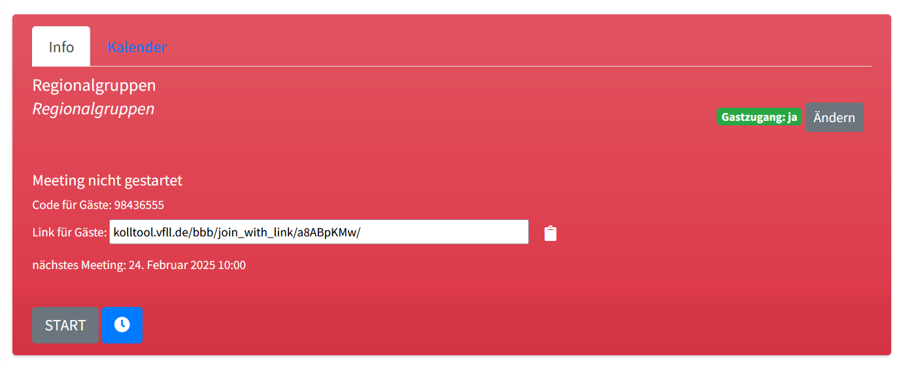

Gäste können nun per Code oder per Link an einem Meeting teilnehmen:

1. **Teilnahme per Code**: Ist der Gastzugang freigeschaltet, wird in der Kachel zusätzlich ein achtstelliger Code angezeigt, den Nicht-User\*innen benötigen, um einem Meeting beizutreten.
2. **Teilnahme per Link**: Zusätzlich wird ein Meeting-Link angezeigt, der sich in die Zwischenablage kopieren lässt.

Code oder Link können an Gäste weitergegeben werden. 

## Wie nehmen Nicht-User an einem Meeting teil?

1. **Zugang mit Code**: Meetings, bei denen der Gastzugang aktiviert ist, die gestartet wurden und mindestens einen Teilnehmer haben, werden beim Aufruf von <kolltool.vfll.de> links unter *Laufende Meetings* angezeigt.Über das Tür-Symbol gelangen die Besucher\*innen zu einer Eingabemaske, in die sie ihren Namen und den Code des Meetings eingeben. Wird der Code akzeptiert, bringt sie *Teilnehmen* direkt zum Meeting.
2. **Zugang mit Link**: Der Link führt auf eine Eingabemaske, in die der Gast seinen Namen eingibt. Anschließend wird er zum Meeting weitergeleitet.

Als Name bitte immer Vor- und Nachname angeben. Ist der Kreis der Teilnehmenden größer und kennen sich nicht alle, ist es sinnvoll, zusätzlich Ort und/oder Regionalgruppe und ggf. Funktion im VFLL anzugeben.

## Wie wird ein Meeting beendet?

Ein BigBlueButton-Meeting kann innerhalb von BigBlueButton beendet werden:

Anklicken von ⋮ öffnet dieses Menü

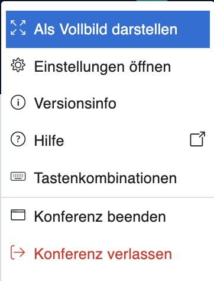

mit den Optionen *Konferenz verlassen* und *Konferenz beenden*.

Falls sich die Meetingraum-Kachel nach Beenden einer Konferenz nicht rot färbt, hilft *Stop*.

## Meetings planen

Über den Button  lassen sich Meetings planen. Jedes geplante Meeting besteht aus – Beginn (Datum und Uhrzeit) – Dauer (in Minuten) – Titel – Beschreibung (optional).

Die geplanten Meetings werden zum vorgesehenen Startpunkt gestartet und automatisch nach der vorgesehenen Dauer beendet, falls sich keine Teilnehmer\*innen mehr im Meeting befinden. 
Eine Übersicht der geplanten Meetings findet sich auf jeder Meeting-Kachel im Reiter *Kalender*. Dort können geplante Meetings auch geändert oder gelöscht werden.

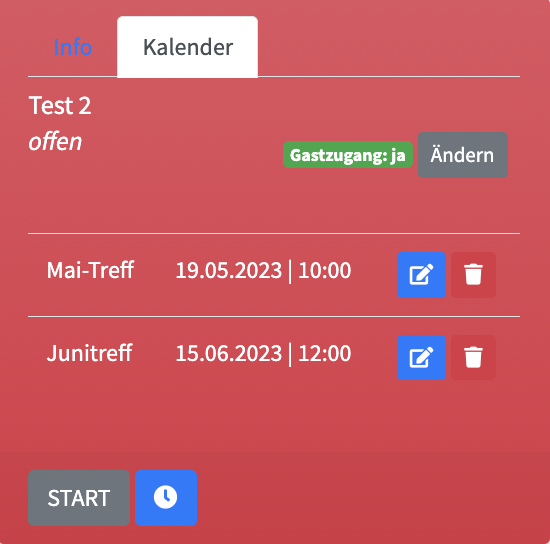

## Weitere Informationen zu BBB

Wer sich detailliert über die Möglichkeiten von BBB informieren möchte findet [hier](https://www.youtube.com/playlist?list=PLeSl48Y1rgh9Cta0kM7IjjHarLRFeXlCF) Videotutorials. 

Auf ein paar Details wird im Folgenden eingegangen.

### Mikrofon und Kamera einschalten

Beim Eintritt in ein BBB-Meeting wird man zunächst gefragt, ob man der Konferenz mit Mikrofon beitreten oder nur zuhören möchte. 

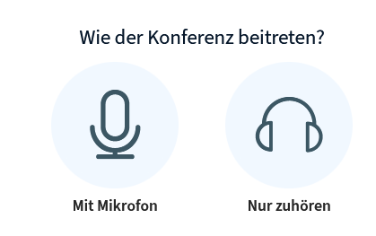

Um mit Webcambild am Meeting teilzunehmen, muss man nun die Kamera freigeben. Dazu klickt man auf das (noch durchgestrichene) Kamerasymbol in der Leiste unten und wählt dann die Option „Webcam freigeben“. Hier hat man auch die Möglichkeit, einen Hintergrund einzustellen.

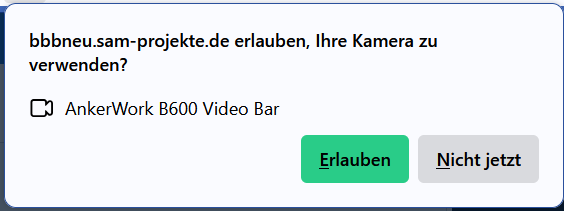

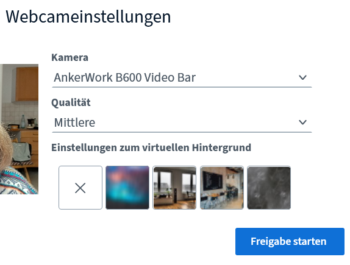

### Die einzelnen Bereiche des BBB-Bildschirms

In der **Menüleiste** links finden sich nehmen der Teilnehmendenliste die Bereiche Nachrichten \(Öffentlicher Chat\) und \(Geteilte\) Notizen.

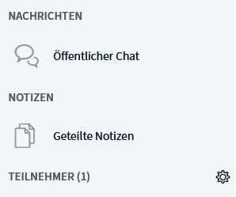

In der **Teilnehmerliste** werden alle Teilnehmenden in Form von Kacheln mit Namen angezeigt. Die Symbole geben an, wie jemand an dem Meeting teilnimmt: mit Mikrofon, nur zuhörend, mit Webcam.

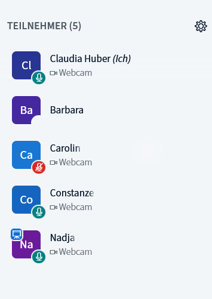

Der **Chat** ermöglicht zum einen Teilnehmenden mit Mikrofonproblemen die aktive Konferenzteilnahme, zum anderen eignet er sich zur Weitergabe von Links oder anderen Informationen, die im aktuellen Zusammenhang von Bedeutung sind.

![Chat][Chatbeispiel](attachments/bbb_chat_beispiel.png)

Speichern kann man den Chatverlauf über das Kontextmenü, das sich rechts oben hinter den drei Punkten verbirgt.

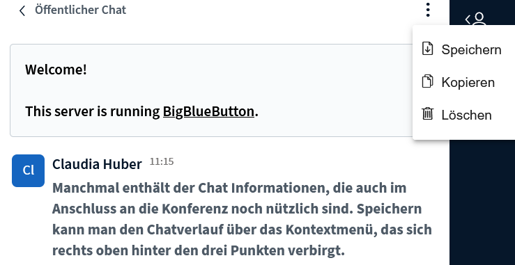

Der Export ist nur als .txt möglich.

Unter **Geteilte Notizen** können beispielsweise Diskussionsergebnisse, getroffene Vereinbarungen oder  Tagesordnungspunkte für die nächste Konferenz festgehalten werden.

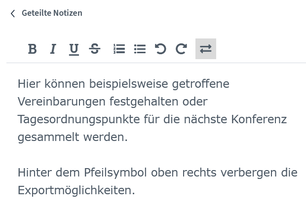

Hinter dem Pfeilsymbol oben rechts verbergen die Exportmöglichkeiten, die dann unten im Notizenfenster angezeigt werden.

Im **Hauptfenster** ist die **Präsentationsfläche** zu sehen, die mit Klick auf den zweiten Button von rechts in der Fußleiste minimiert werden kann. 

 
Hinter dem rechten Button in Buttongruppe in der Mitte verbirgt sich die **Bildschirmfreigabe**.

Dafür benötigt man Präsentatorrechte. Alle Teilnehmenden können sich entweder mit Klick auf das Pluszeichen in der Fußleiste oder im Kontextmenü der Kachel. 

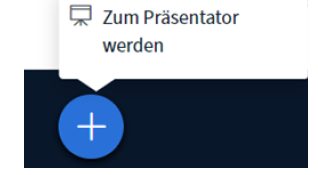

Alternativ geht das über die Teilnehmerliste:

![Über die Teilnehmerliste zum Präsentator werden][Präsentator_werden_Alternative](attachments/bbb_praesentator_werden_Alternative.png)

Klickt man auf „Bildschirm freigeben“, erscheint folgendes Fenster:

Hier kann man auswählen, was freigegeben werden soll und muss die Freigabe bestätigen.

Wichtig: Es können nur Browserfenster freigegeben werden, keine Browseratabs.

Nützlich ist die **Umfragefunktion**, die auch zu Abstimmungen genutzt werden kann und von mehreren Regionalgruppen für Wahlen genutzt wird.

Wichtig: Die Person, die die Umfrage stellt, kann an dieser Umfrage nicht teilnehmen. Ihr Votum muss zur Ermittlung des Endergebnisses addiert werden.

Klickt man auf „Umfrage starten“, öffnet sich das folgende Fenster:

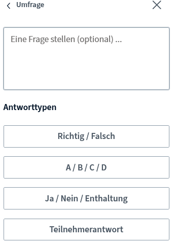

Wichtig ist das Feld „Teilnehmerantwort“. Standardmäßig sind die Umfragen nicht anonym. Über den Schieberegler kann das geändert werden.

Der Umfragetyp Ja / Nein / Enthaltung lässt sich für Wahlen in den RG nutzen (nicht vergessen, die Teilnehmerantwort auf anonym zu setzen!).

In dem folgenden Beispiel wurde danach gefragt, ob das KollTool nützlich ist.

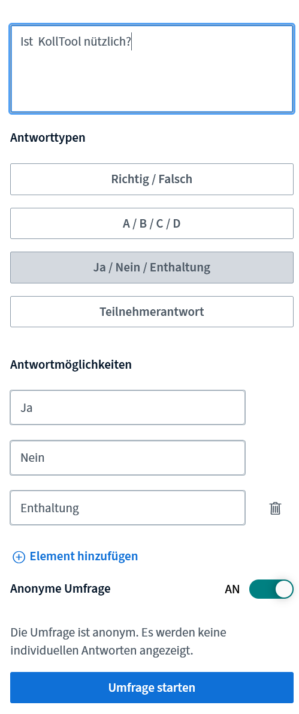

Sobald die Umfrage gestartet ist, erscheint folgendes Fenster:

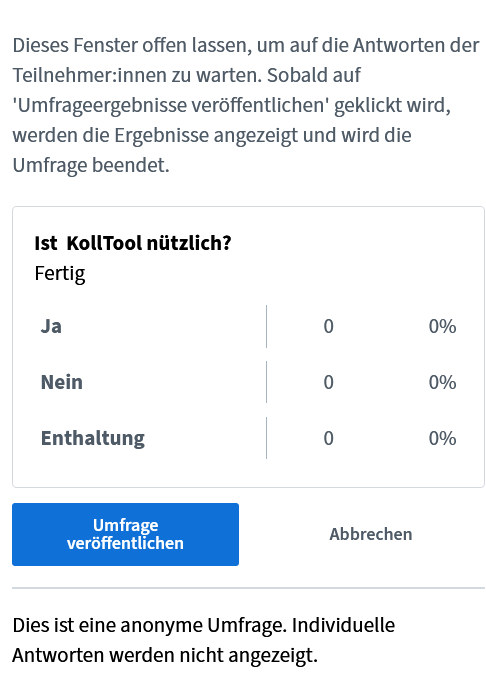

Ist die Umfrage abgeschlossen, kann das Ergebnis veröffentlicht werden. Es erscheint in der rechten unteren Ecke des Präsentationsfensters:

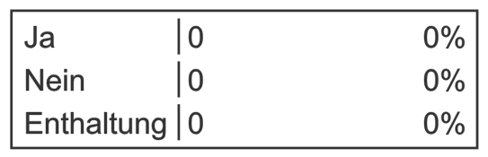

## Zoom Meetings

siehe [[zoom]].

