# Verzeichnisse und Dokumente

Links in der Menüleiste findet man den Menüpunkt *Dokumente*. Ein Klick darauf öffnet das Untermenü mit den Einträgen *Verzeichnisse* und *Tags*.

*Hinweis*: Da viele Kolltool-User\*innen mehreren Teams angehören, ist es wichtig, Verzeichnisse und Dokumente eindeutig zu benennen: statt „Aktuelles“ also beispielsweise „RR – Aktuelles“ und „OE – Protokolle“ und „RR – Protokolle“ statt „Protokolle“. Das erleichtert das Auffinden.

## Verzeichnisse

Dokumente sind im KollTool analog zur Dateistruktur auf dem Computer in Verzeichnissen gruppiert.

Ein Klick auf den Menüpunkt *Verzeichnisse* öffnet eine Tabelle mit sämtlichen Verzeichnissen aller Teams, in denen man Mitglied ist. 

Auf dieser Seite kann man nun folgende Dinge tun:

+ ein neues Verzeichnis anlegen
+ in einem vorhandenen Verzeichnis ein Dokument \(abgekürzt: Dok\) anlegen
+ ein Verzeichnis teilen
+ ein Verzeichnis mit Sternchen als *wichtig* kennzeichnen \(es erscheint dann im Dashboard unter „Meine Favoriten“\)
+ das Verzeichnis löschen

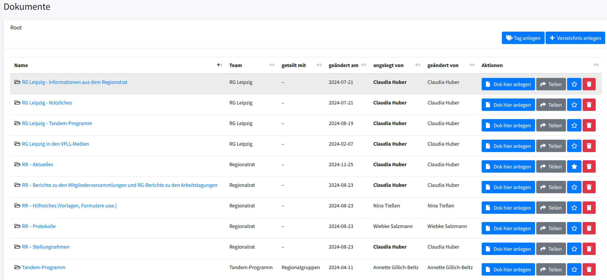

## Verzeichnis anlegen

Oben rechts findet man die Buttons *Tag anlegen* und *Verzeichnis anlegen*.

Tags dienen der Beschreibung der Verzeichnisse und Dokumente und sind wichtig fürs Suchen.

Beim Klick auf *Verzeichnis anlegen* öffnet sich eine Eingabemaske mit drei Feldern:

+ Name \(des Verzeichnisses\),
+ Team \(dem das Verzeichnis gehören soll\) und
+ Beschreibung \(des Verzeichnisses\).

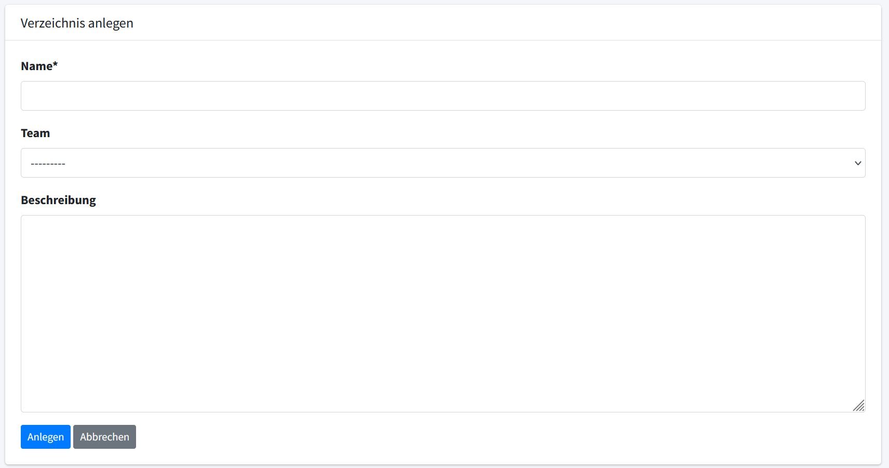

Nach Ausfüllen der Felder klickt man auf *Anlegen* (unten links unter der Eingabemaske).

Daraufhin erscheint die Bestätigung, dass das Verzeichnis angelegt wurde.

Darunter werden Name und Team des Verzeichnisses genannt, ob es mit anderen Teams geteilt ist und was die\*der Anlegende damit tun kann.

Neben dem Namen des Verzeichnisses erscheint rechts ein Stiftsymbol. Ein Klick darauf öffnet eine Eingabemaske, in der der Name des Verzeichnisses und die Beschreibung geändert werden können. Das Team kann nicht geändert werden.

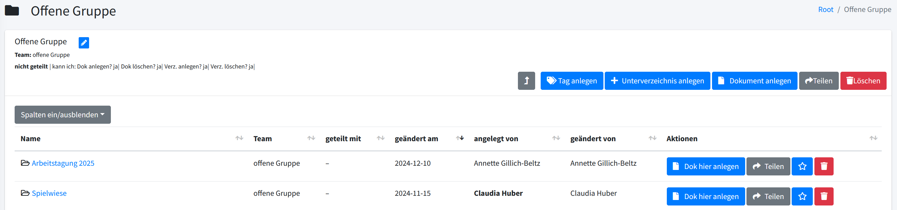

Zudem werden oben 6 Buttons angezeigt für weitere Aktionen; von links nach rechts:

+ Nach oben geknickter Pfeil: führt zurück auf die Tabelle der Verzeichnisse
+ *Tag anlegen*: Tags dienen der Beschreibung der Verzeichnisse und Dokumente und sind wichtig fürs Suchen
+ *Unterverzeichnis anlegen*: ein Unterverzeichnis im gerade angelegten Verzeichnis anlegen, wodurch eine Baumstruktur entsteht, wie man sie von Dateiordnern kennt
+ *Dokument anlegen*: Anlegen eines Dokuments im gerade angelegten Verzeichnis
+ *Teilen*: Das gerade angelegte Verzeichnis mit anderen Teams teilen
+ *Löschen*: Das gerade angelegte Verzeichnis löschen

Direkt darunter gibt es einen Button *Spalten ein/ausblenden*, mit dem man die Anzeige beeinflussen kann.

### Unterverzeichnis im Verzeichnis anlegen

Ein Klick auf *Unterverzeichnis anlegen* öffnet die schon bekannte Eingabemaske mit einem Unterschied zu eben: Das Team ist nun fest eingestellt, es kann nicht mehr frei gewählt werden. Das Unterverzeichnis gehört damit automatisch dem Team, dem das übergeordnete Verzeichnis gehört.

### Verzeichnis teilen

Ein Klick auf diesen Button öffnet eine Liste mit allen vorhandenen Teams -- auch der Teams, in denen man selbst nicht Mitglied ist. Man kann sein Verzeichnis also auch mit diesen teilen.

Man setzt nun ein Häkchen an das Team oder die Teams, mit denen man sein Verzeichnis teilen will und klickt auf *Teilen*.

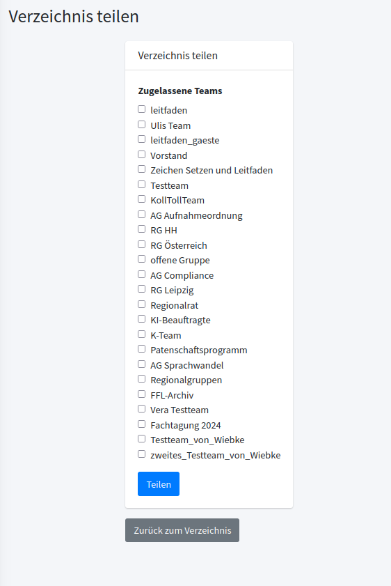

Es erscheint die Bestätigung des Teilens und eine Beschreibung:

+ Name des Teams, mit dem geteilt wurde
+ Button *Entfernen* zum Aufheben der Teilung
+ Feststellung, dass das Team, mit dem das Verzeichnis geteilt wurde, die Dokumente nicht editieren kann
+ Button *Schutz aufheben*, mit dem dem anderen Teams das Editieren von Dokumenten im geteilten Verzeichnis erlaubt werden kann

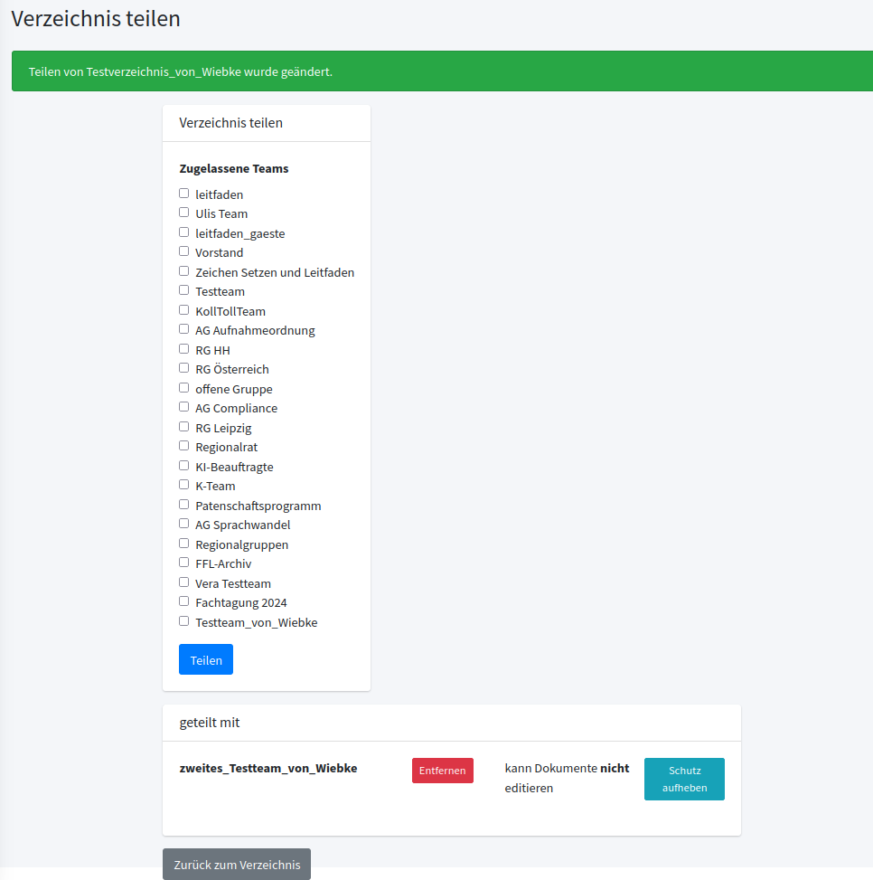

Klickt man auf *Schutz aufheben*, erscheint *kann Dokumente editieren* und der Button heißt nun *Schützen*. Ein Klick darauf verbietet dem anderem Team das Editieren wieder.

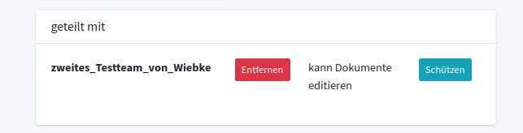

Ein Klick auf den grauen Button ganz unten *zurück zum Verzeichnis* bringt einen (ja, tatsächlich) zurück zum Verzeichnis.

## Dokument im Verzeichnis anlegen

Beim Klick auf *Dokument anlegen* erscheint eine Eingabemaske mit den Feldern:

+ Titel \(des Dokuments\)
+ Team \(nicht änderbar, hier steht automatisch das Team, dem das Verzeichnis gehört: diesem gehören alle Dokumente im jeweiligen Verzeichnis\)
+ Tags
+ Inhalt

Unter *Inhalt* wird der Text angelegt und mithilfe der angezeigten Funktionen formatiert.

Ein Klick auf *Speichern* unten links speichert das Dokument im Verzeichnis, das fertige Dokument wird angezeigt.

Man kann außerdem wählen, welche Teammitglieder über das neue Dokument benachrichtigt werden sollen.

Rechts neben dem Dokument sind die Eigenschaften aufgelistet:

+ Team, dem das Dokument gehört
+ Team\(s\). mit denen das Dokument geteilt ist
+ Wer es angelegt hat
+ Wann es angelegt wurde
+ Wann es zuletzt geändert wurde
+ Von wem es zuletzt geändert wurde

Die letzten beiden Punkte sind Nutzer\*innen-spezifisch

+ Kann ich als Nutzer\*in es lesen?
+ Kann ich als Nutzer\*in es editieren?

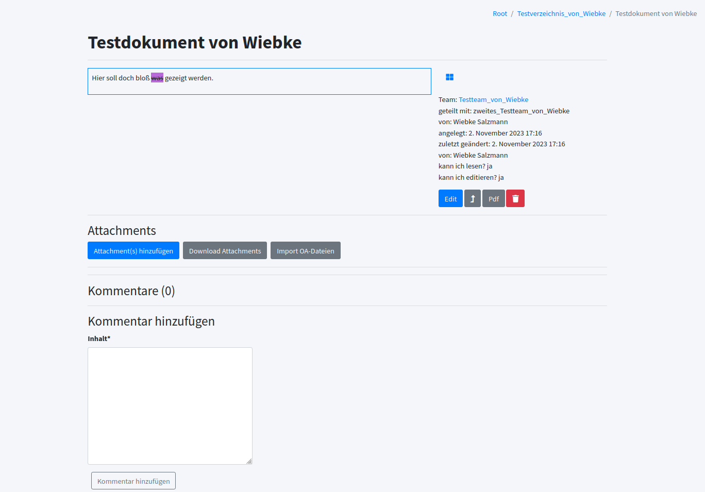

Unter dieser Liste finden sich 4 Buttons:

+ *Edit*: Ein Klick hierauf öffnet die Eingabemaske von eben und man kann den Text im Dokument sowie auch dessen Titel ändern.
+ Nach oben geknickter Pfeil: führt zurück ins Verzeichnis, in dem das Dokument liegt. Um wieder zum Dokument zu gelangen, klickt man das Dokument an.
+ *pdf*: erzeugt ein pdf des Dokuments
+ Papierkorbsymbol: Löschen des Dokuments

*Hinweis*: Dokumente lassen sich in der Dokumente-Übersicht des Verzeichnisses mit Klick auf das Sternchen-Symbol als wichtig kennzeichnen. So gekennzeichnete Dokumente werden im Dashboard unter „Meine Favoriten“ aufgelistet.

### Attachments an Dokumenten

Oft möchte man gar nicht unbedingt Texte direkt im Eingabefeld eingeben, sondern fertige Dateien (pdf oder Text-Dateien) im KollTool ablegen, z. B. Protokolle von Sitzungen.

In diesem Fall legt man ein Dokument mit einer kurzen Beschreibung der Datei, um die es geht; an. Die Datei selbst fügt man dann als Attachment an. Die Buttons zum Anfügen von Attachments oder zum Herunterladen bereits vorhandener Attachments finden sich unübersehbar unter dem Dokument.

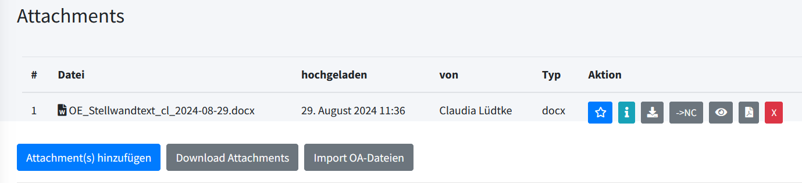

Die Liste der Attachments zu einem KollTool-Dokument enthält mehrere Spalten: Nummer, Dateiname, Hochladedatum und hochladende Person, Typ sowie Aktion.

Welche *Aktionen* angeboten werden, ist vom Dateityp des Attachments abhängig.  
Für alle Dateitypen gilt: mit Sternchen als wichtig kennzeichnen, unter i die Dateibeschreibung (siehe oben) einsehen, das Attachment herunterladen, das Attachment ansehen und löschen.  
Für .dotx-Dateien kommen zwei weitere Möglichkeiten dazu: Dokument in die Nextcloud verschieben \(--> NC, das Team einen [Nextcloud-Zugang](https://kolltool.vfll.de/docs/nextcloud/) hat\) und Umwandlung in eine PDF. 

### Kommentare zu Dokumenten

Unterhalb dieser Buttons findet sich noch ein Kommentarfeld. Hier können Teammitglieder Kommentare zum Dokument abgeben. Ein Klick auf *Kommentar hinzufügen* speichert den Kommentar beim Dokument ab. Er wird dann angezeigt mit Inhalt, Autor\*in und Veröffentlichungsdatum und es öffnet sich ein Textfeld für den nächsten Kommentar. Eigene Kommentare können durch Anklicken von *löschen* wieder gelöscht werden.

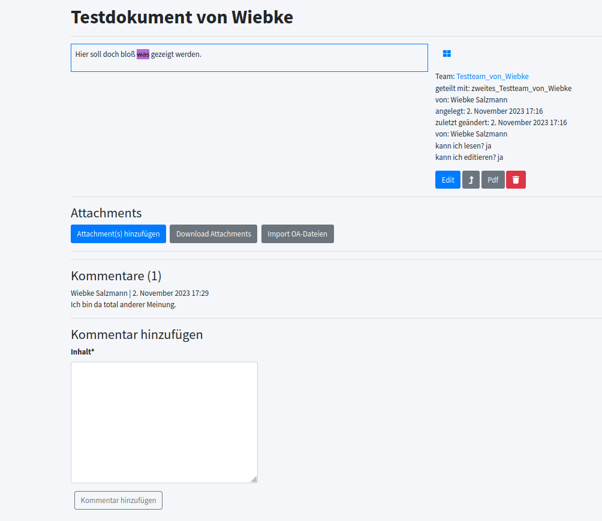

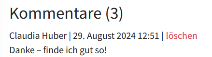

### Verschieben von Dokumenten in andere Verzeichnisse

Stellt man fest, das sich eine einmal gewählte Verzeichnisstruktur nicht bewährt oder wurde ein Dokument nicht im passenden Verzeichnis angelegt, lassen sich Dokumente in andere Verzeichnisse verschieben.

Dazu dient der graue Button mit Ordnersymbol, auf das ein Pfeil zeigt, unter Aktionen.

![Dokument in ein anderes Verzeichnis verschieben][Dokument_verschieben](attachments/dokument_verschieben.png)

Ein Klick darauf öffnet ein Auswahlfeld, in dem man das gewünschte Zielverzeichnis anklicken kann.

Nach Verschieben des Dokuments erscheint das Dokument in dem neuen Verzeichnis. Eigentümer des Dokuments ist nun das Team, dem das neue Verzeichnis gehört.

Aus dem alten Verzeichnis ist das Dokument nach dem Verschieben verschwunden.

## Tags

Dokumente können mit Tags charakterisiert werden. Anhand dieser Tags können sie dann gesucht werden.

Unter dem Menüpunkt *Tags* (Menüleiste links, erscheint im Untermenü nach Anklicken von *Dokumente*) kann man sich die vorhandenen Tags auflisten lassen.

Neben den Tags erscheint das Team \(oder die Teams\), die Zugriff auf diese Tags haben. Möchte man einen vorhandenen Tag nutzen, klickt man auf das Stiftsymbol und kreuzt in der erscheinenden Liste das eigene Team an.

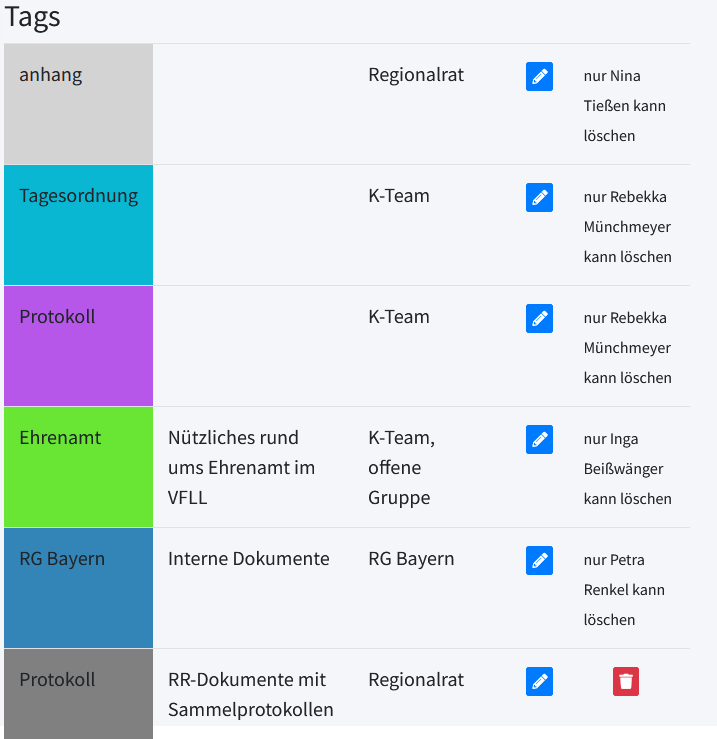

Ist von den vorhandenen Tags keiner für den eigenen Zweck geeignet, gibt es unterhalb der Liste die Möglichkeit, einen neuen Tag anzulegen.

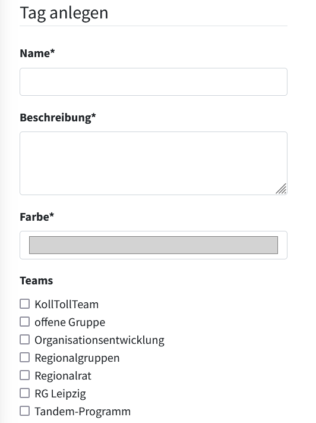

Man gibt dem neuen Tag einen Namen, eine Beschreibung und klickt die Teams an, die ihn nutzen sollen. Die genannten Punkte sind verpflichtend.

Beim Anlegen eines Dokuments oder auch beim Editieren eines vorhandenen Dokuments werden einem die Tags angezeigt, die vom eigenen Team genutzt werden können. Man kann nun die gewünschten Tags anklicken und nach dem Speichern bzw. dem Update werden diese rechts neben dem Dokument angezeigt.

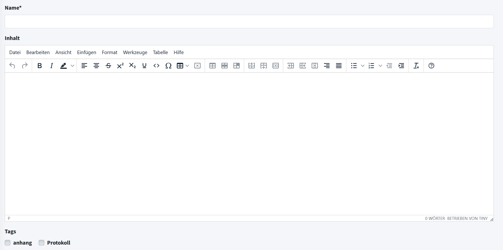

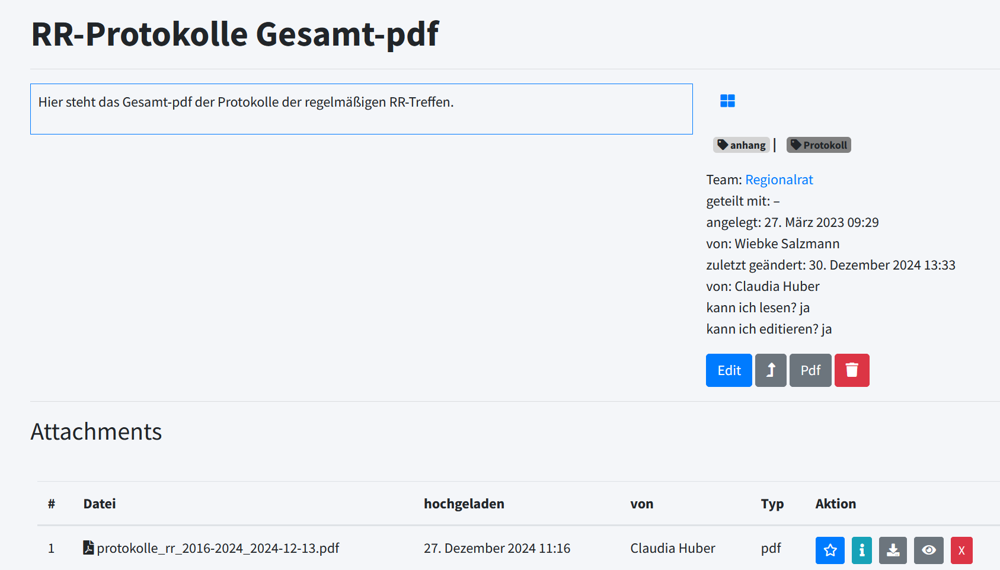

## Arbeiten mit Dokumenten im KollTool

Es gibt verschiedene Möglichkeiten, um mit Dokumenten zu arbeiten: 

+ Dokumente editieren
+ Dokumente kommentieren und abschließend das Dokument editieren

Direkt Dokumente zu *editieren* eignet sich beispielsweise für die Erstellung von Tagesordnungen für regelmäßige Team-Meetings oder für das Zusammentragen von Informationen zu einem Thema.  
Damit die Textänderungen im Fall von Rückfragen zugeordnet werden können, jeweils Namen oder Namenskürzel angeben.

Mit *Kommentaren* zu arbeiten bietet sich an, wenn das fertige Dokument außerhalb des KollTools verwendet werden soll. Beispiel: Der Regionalrat verfasst eine Stellungnahme für den Vorstand. Das KollTool-Dokument ist zunächst ein Entwurf, der dann anhand der Kommentare überarbeitet wird.

Sollen umfangreichere Dokumente gemeinsam bearbeitet werden, ist die Nutzung der Nextcloud sinnvoll. Näheres dazu siehe <https://kolltool.vfll.de/docs/nextcloud/>.

