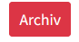

# Umfrage-Tool

Im KollTool können Umfragen durchgeführt werden. Die zugehörige App ist über die Menüleiste \(*Umfragen*\) erreichbar.

## Liste der Umfragen

Die Übersichtsseite zeigt alle nicht archivierten Umfragen.

+ **Abgeschlossene Umfragen** werden durch einen Haken  symbolisiert.
+ Falls die Umfrage einem oder mehreren **Teams** zugeordnet ist, werden die Teams aufgelistet.
+ Falls die Umfrage bestimmten **Usern** zugeordnet ist wird das Symbol  angezeigt
+ Umfragen, die noch nicht abgeschlossen sind, können von dem User, der sie angelegt hat \(*Creator*\), **editiert**  oder **beendet**  werden.
+ **Sortieren**: Die Übersicht der Umfragen kann nach *Name* \(Feld \*Text*), Datum* \(der Erstellung\) und *Stimmen* \(Anzahl\) sortiert werden.
+ **Suche**: Im Suchfeld kann nach dem Text der Umfrage gesucht werden.

## Umfrage anlegen

Über den Button  kann eine neue Umfrage angelegt werden. Der User, der diese Aktion ausführt, wird zum *Creator* der Umfrage.

Folgende Felder stehen zur Verfügung:

+ *Text*: Die Beschreibung der Umfrage. Der Beginn dieses Texts wird in der Umfragen-Übersicht angezeigt, d. h., die erste Zeile des Texts kann als Titel der Umfrage verwendet werden.
+ *Teams*: Hier können Teams \(eines oder mehrere\) ausgewählt werden. Ist das der Fall, ist die Umfrage nur für die Mitglieder dieser Teams sichtbar.
+ *User*: Hier können User \(einer oder mehrere\) ausgewählt werden. Ist das der Fall, ist die Umfrage nur für diese User\*innen \(zusätzlich zu den ggf. ausgewählten Teams\) sichtbar.
+ Sind weder Teams noch User ausgewählt, ist die Umfrage **offen** für alle KollTool-User\*innen.
+ *Anonym*: Wird dieses Feld angeklickt, werden in der Ergebnisansicht zur Umfrage die Namen der Umfrage-Teilnehmer\*innen *nicht* gezeigt.
+ *Optionen*: Hier werden die Antwortmöglichkeiten der Umfrage festgelegt. Anklicken von *+ weitere Option* erzeugt ein weiteres Eingabefeld. 

## Umfrage beenden

In der Umfrage-Übersicht können laufende Umfragen durch den *Creator* der jeweiligen Umfrage beendet werden \(Button \).

## Umfrage editieren

In der Umfrage-Übersicht können laufende Umfragen durch den *Creator* der Umfrage bearbeitet werden \(Button \).   
Zur Bedeutung der Felder siehe *Umfrage anlegen*.

## Umfrage archivieren

Abgeschlossene Umfragen können vom *Creator* der Umfrage archiviert werden \(Button \). Archivierte Umfragen werden in der Umfrage-Übersicht *nicht* mehr gelistet.

Wer eine archivierte Umfrage wieder sichtbar machen möchte, wendet sich bitte an den [Admin](mailto:kolltooladmin@vfll.de).

## Ergebnis der Umfrage

Ist eine Umfrage beendet, führt der Aufruf der Umfrage in der Übersicht zum Ergebnis der Umfrage.

Gezeigt werden:

+ der Stimmenanteil der zur Abstimmung gestellten Optionen
+ die abgegebenen Stimmen \(ggf. anonym, siehe oben\)

