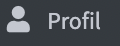

# Benutzerprofile

Jeder Benutzer hat im KollTool ein eigenes Profil (→ {: width=50}, in dem er Vor- und Zuname, ein Profilbild und Angaben zu seiner Biografie pflegen kann.

Alle Felder sind für das KollTool *optional*, da die Useridentifizierung und -authentifizierung über den intern geführten *username* und die E-Mail-Adresse läuft. 

Trotzdem ist es sinnvoll, zumindest die Felder Vorname und Nachname auszufüllen bzw. (falls sie beim Anlegen des Accounts schon eingetragen wurden) sie ggf. zu korrigieren.